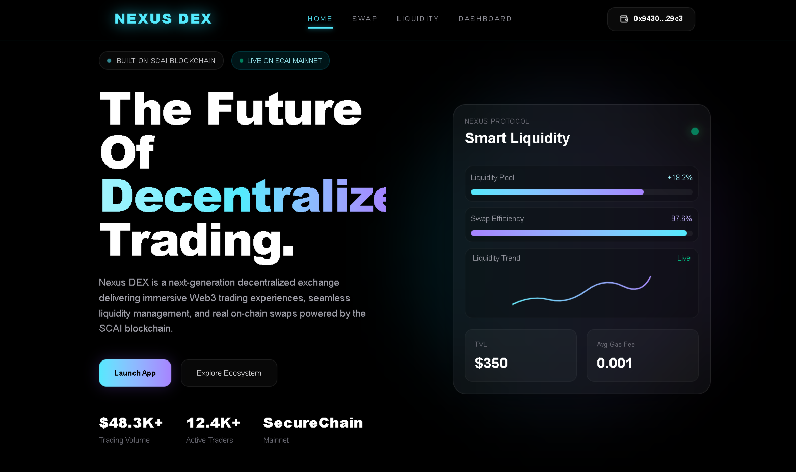
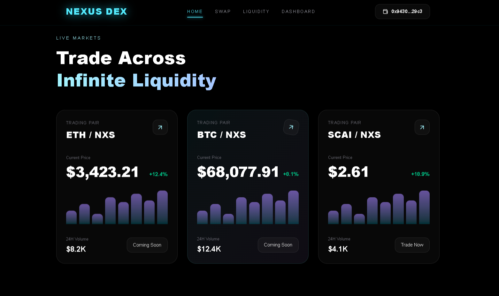
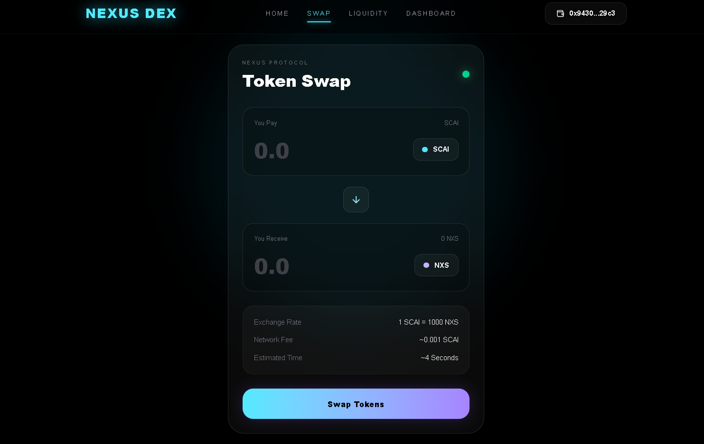
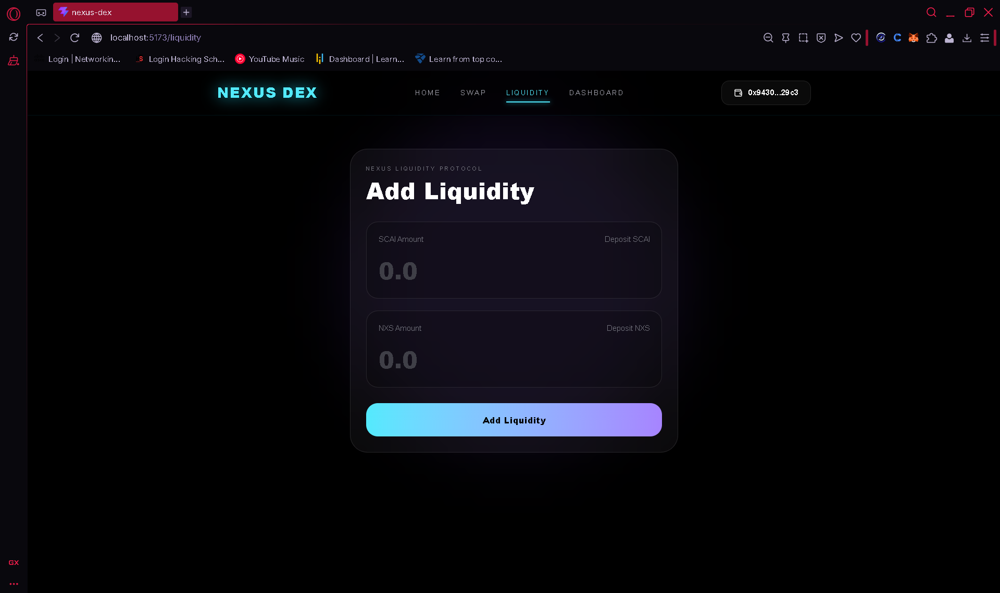
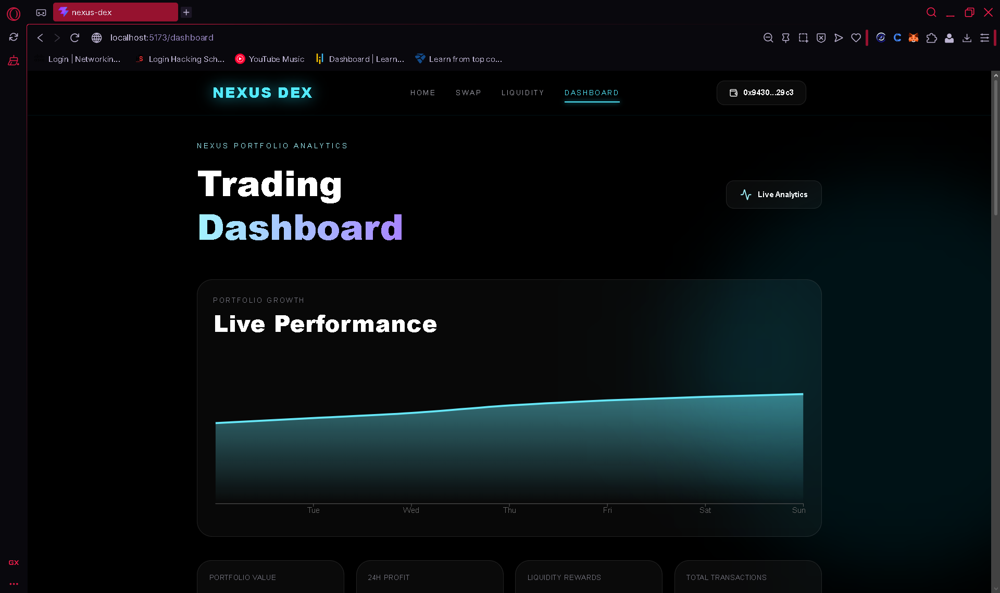
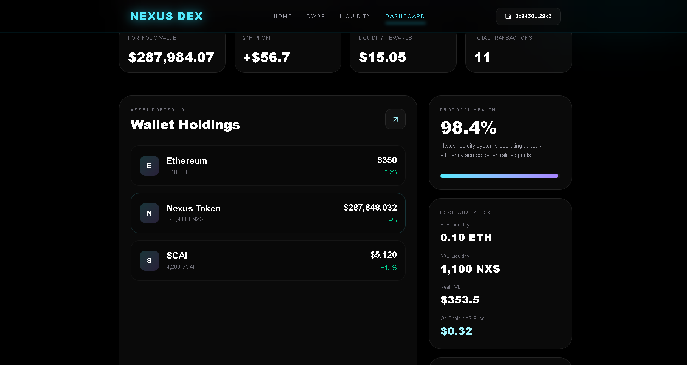

<div align="center">

# ⚡ NEXUS DEX

### Next-Generation Decentralized Exchange Built on SecureChain AI Mainnet



<br/>

[](https://nexus-dex-sigma.vercel.app)

[](https://soliditylang.org/)

[](https://react.dev/)

[](https://hardhat.org/)

[](https://vercel.com/)

</div>

---

# 🌌 Overview

Nexus DEX is a fully functional decentralized exchange (DEX) deployed on the **SecureChain AI (SCAI) Mainnet**, enabling users to perform real on-chain token swaps, provide liquidity, and interact with smart contracts through a modern cinematic Web3 interface.

This project was built as a complete full-stack blockchain application using:

- Solidity Smart Contracts
- React.js Frontend
- Hardhat Development Environment
- Ethers.js Web3 Integration
- Vercel Production Deployment

---

# ✨ Core Features

## 🔄 Token Swapping
Users can swap SCAI ↔ NXS tokens directly through MetaMask with live blockchain transaction execution.

---

## 💧 Liquidity Pool System
Users can add liquidity into the Nexus liquidity pool and interact with real smart contract liquidity functions on-chain.

---

## 🦊 Wallet Integration
- MetaMask Connection
- Wallet-based Authentication
- Real Transaction Signing
- Live Blockchain Interaction

---

## 📊 Live Dashboard Analytics
The dashboard provides:
- Portfolio tracking
- Liquidity insights
- Protocol health metrics
- Transaction history
- Live market visualization

---

# 🚀 Live Deployment

## 🌐 Frontend
https://nexus-dex-sigma.vercel.app

---

## 📂 GitHub Repository
https://github.com/nivas2104-hue/nexus-dex

---

# 🧠 Smart Contracts

## 🪙 NXS Token Contract

```solidity
0xb636D73a75c5617FeCF034F028CbC5c597107586
```

---

## 🔁 NexusSwap Contract

```solidity
0xcbCC2968592A9283168B80ECEA311962b7101fFC
```

---

# 🛠️ Tech Stack

<table>
<tr>
<td align="center"><b>Frontend</b></td>
<td align="center"><b>Blockchain</b></td>
<td align="center"><b>Deployment</b></td>
</tr>

<tr>
<td>

- React.js
- Vite
- Tailwind CSS
- Framer Motion
- Ethers.js

</td>

<td>

- Solidity
- Hardhat
- OpenZeppelin
- SecureChain AI Mainnet

</td>

<td>

- Vercel
- GitHub

</td>
</tr>
</table>

---

# 📸 Application Screenshots

# 🏠 Homepage


<br/>



---

# 🔄 Swap Interface



---

# 💧 Liquidity Management



---

# 📊 Dashboard Analytics



<br/>



---

# 🔒 Security Considerations

The project implements multiple security-focused blockchain practices:

- ✅ OpenZeppelin ERC20 Standards
- ✅ Solidity ^0.8 Overflow Protection
- ✅ Secure ERC20 Allowance Handling
- ✅ MetaMask Transaction Signing
- ✅ Wallet-based Authorization
- ✅ Reentrancy-aware Smart Contract Architecture

---

# 🧪 Smart Contract Testing

Hardhat test suite includes:

- Token Deployment Testing
- ERC20 Transfer Testing
- Liquidity Addition Testing
- Swap Transaction Testing

Run tests locally:

```bash
npx hardhat test
```

---

# ⚙️ Local Development Setup

## Clone Repository

```bash
git clone https://github.com/nivas2104-hue/nexus-dex.git
```

---

## Install Dependencies

```bash
npm install
```

---

## Run Development Server

```bash
npm run dev
```

---

## Run Smart Contract Tests

```bash
npx hardhat test
```

---

# 🌐 SecureChain AI Mainnet

| Property | Value |
|---|---|
| Network | SecureChain AI Mainnet |
| Chain ID | 34 |
| RPC URL | https://mainnet-rpc.securechain.ai |

---

# 🎯 Project Highlights

✅ Fully Functional Web3 DApp  
✅ Real Blockchain Transactions  
✅ Live Mainnet Deployment  
✅ Production Frontend Hosting  
✅ Smart Contract Testing  
✅ Liquidity Pool Integration  
✅ MetaMask Wallet Support  
✅ Responsive Cinematic UI  

---

# 👨‍💻 Author

## Nivas

Built for the **EtherAuthority Web3 Internship Program 2026**

---

<div align="center">

# ⚡ Built on SecureChain AI Mainnet ⚡

</div>
